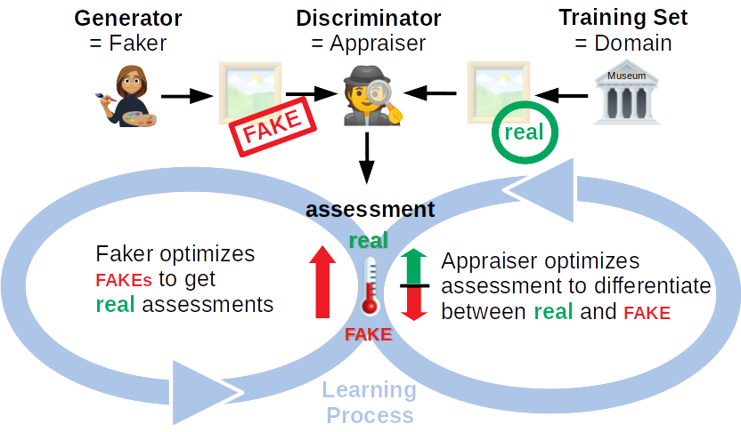
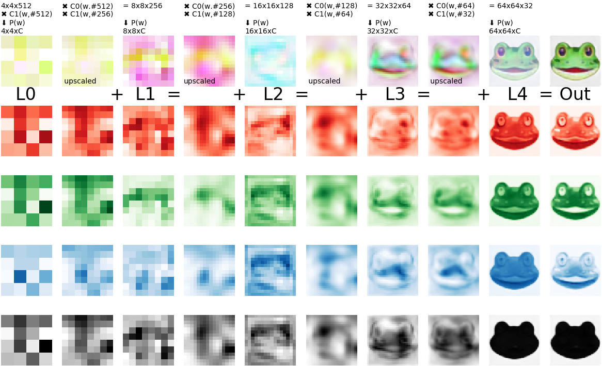

# StyleGAN2 in a Nutshell

* Best in class **GAN** for artificially synthesizing natural-looking images by means of Machine Learning 
* There are approx. 50 [pre-trained StyleGAN2](https://www.opensourceagenda.com/projects/awesome-pretrained-stylegan2) domain models available publicly
* Each StyleGAN2 domain model can synthesize endless variations of images within the respective domain
* Invented by NVIDIA 2020, see [teaser video](https://www.youtube.com/watch?v=9QuDh3W3lOY) & [source code](https://github.com/NVlabs/stylegan2-ada)
* New Version "[Alias-Free GAN](https://nvlabs.github.io/alias-free-gan/)" expected in September 2021
* Examples from [afhqwild.pkl](https://nvlabs-fi-cdn.nvidia.com/stylegan2-ada/pretrained/) and [ffhq.pkl](https://nvlabs-fi-cdn.nvidia.com/stylegan2-ada/pretrained/) model data (generated on my own implementation):

   
  

**Legal information**:
All content of "StyleGAN2 in a Nutshell" is **© 2021 [HANS ROETTGER](mailto:oss.roettger@posteo.org)**. You may use parts of it in your own publications, if you mark them clearly with "source: oss.roettger@posteo.org"

## What is a GAN - Generative Adversarial Network?
* First invented at Universite de Montreal 2014 (see [evolution of GANs](https://github.com/marload/GANs-TensorFlow2))
* **Generative Network**: A **Generator** synthesizes fake objects similar to a **Training Set** (domain)
* **Adversarial**: the **Generator** and a **Discriminator** component compete each other and hence become both better and better with each optimization step in a learning process
* Even when the Generator & the Discriminator synthesize & assess totally random in the beginning, eventually the Generator will have learned to synthesize fake objects that could hardly distinguished from the Training Set. 

  

## StyleGAN2 Special Properties: z ➡️Image

* The StyleGAN2 **Generator** synthesizes outputs based on a small input vector z "modulation“ (typical size: 2048 Byte)
* Different z generate different outputs
* Therefore z could be interpreted as a very compressed representation of the synthesized output
* For almost all natural images there exists a [generating z](https://github.com/oss-roettger/HR_Encoder)
* Most important: Similar z generate similar output objects! Accordingly a linear combination of two input vectors z1 & z2 results in an output object in between the z1 &  z2 generated outputs 

 

## The Learning Process

* Needs approx. 10,000 images in the **Training Set**
* Takes a few days of computing time 
* Video below: learning process based on 11,300 fashion images fed 200 times (= "epochs") to the **Discriminator** resulting in more than 2 million optimization steps for the Discriminator and the Generator. The video shows the generated fake images after each learning epoch. The 90 images in each video frame are linear combinations of the four input vectors z in the four corners. Remember: similar z generate similar outputs!

  

## The Generator in Detail

The StyleGAN2 Generator has no clue WHAT it is synthesizing (no hidden 3D geometrical model, no part/whole relationships, no lighting models, no nothing). It is just adding and removing dabs of paint, starting at a very coarse resolution and adding finer dabs in consecutive layers - similar to the wet-on-wet painting technique of [Bob Ross](https://en.wikipedia.org/wiki/Bob_Ross).

### z (mapped to w) ➡️ Image

64x64xRGBA image generator with 5 layers that has learned to generate emojis. All output layers have been normalized to visualize the full information contained (different ranges of values in reality). An other example with 6 layers: [256x256xRGB](./media/generator_ffhq.png)

* The output image is synthesized as the sum of the consecutive image layers L
* Each image layer L is a projection P of a higher dimensional data space into the desired number of image channels C
* The higher dimensional data space for each L is generated by convolution filters C1, C2 from its predecessor
* The Input vector w „modulates“ each convolution filter and the projection! (w is a mapped version of z to achieve equal distribution in image space)
* Additionally noise is added in each layer to generate more image variations. Final result of applying noise to different layers:

  L0:  L1:  L2:  L3:  L4: 

## Own Experiments & Experience
* Reimplemented StyleGAN2 from scratch to understand how it works and to eliminate some flaws of NVIDIAs reference implementation
* NVIDIA implementation flaws: outdated Tensorflow version, squared RGB Images only, proprietary & non-transparent dnnlib, mode collapse tendency, bad CPU inference
* Own Implementation: slightly slower, needs much more GPU memory, but other flaws eliminated!
* Starting point: collected and applied the pre-trained domain models available on public websites
* Training of own StyleGAN2 domain models needs high amount of computational resources and well prepared Training Sets (at least 5000 images; StyleGAN ADA claims to work with 2000 images)
* Training Sets need to have a lot of variation within but should not be too diverse. Spacial alignment is also critical, since neural networks do not cope with translations well. Upcoming  "[Alias-Free GAN](https://nvlabs.github.io/alias-free-gan/)" claims to deal better with translations and rotations

### What Training Sets Worked Well?
Catalog images and consecutive frames from video clips!

* Emoji Model (64x64xRGBA, Training Set size: 6620 [source](https://emojipedia.org/))

   
  
* Fashion Model (128x64xRGB, Training Set size: 11379 [source](https://vision.cs.ubc.ca/datasets/fashion/))

   
  
* Rain Drops Model (64x128xGray, 3800 images from own video clip)

  
  

### What Did Not Work?
Too much diversity in the Training Set.

* Stamp Model (48x80xRGB, 11491 images from various stamp catalogs)
  In this example StyleGAN  learned that a stamp has pips, a small border and typical color schemes but the motivs were to divers to be learned:
  
  

### Machine Learning Development Environment

* [Tensorflow](https://www.tensorflow.org/) (Google) vs. [PyTorch](https://pytorch.org/) (Facebook); ML Abstraction Layer [Keras](https://keras.io/about/)
* Use GPU acceleration!
  - 10x Computational Power in float32 (standard for ML)
  - BUT slower than CPU in float64 (scientific applications)
  - 10x faster memory access. Get as much GPU memory as possible!
  - Slower GPU just needs more time, but if ML network does not fit into GPU memory, you can‘t use it at all. 

* My development environment
  - Ryzen 5600x (64 GB) + RTX 3060 (12 GB)
  - Tensorflow 2 in [Jupyter Notebooks](https://jupyter.org/) running in [Docker Container](https://www.docker.com/resources/what-container)
